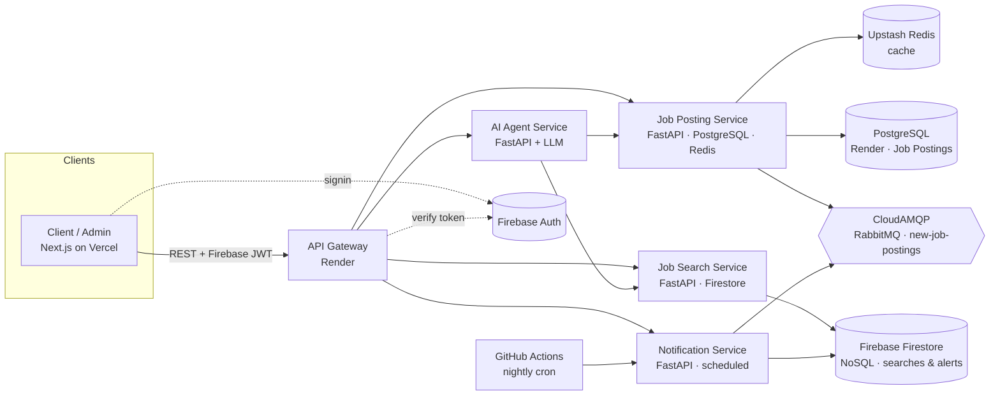

# SE 4458 — Final Project 

**Job Search Web Application** (kariyer.net-style) — full-stack microservice
implementation for the SE 4458 (Software Architecture & Design of Modern
Large Scale Systems) final, May 2026.

---

## Final Deployed URLs

| Component | URL |
|---|---|
| Frontend (Next.js) | https://job-search-application-bice.vercel.app |
| API Gateway | https://kariyer-api-gateway.onrender.com |
| Job Posting Service | https://kariyer-job-posting.onrender.com |
| Job Search Service | https://kariyer-job-search.onrender.com |
| Notification Service | https://kariyer-notification.onrender.com |
| AI Agent Service | https://kariyer-ai-agent.onrender.com |

**Demo video (≤ 5 min):** https://youtu.be/REPLACE_ME

---

## Architecture Overview



---

## Repository Layout

```
job-search-application/
├── docker-compose.yml          # local dev only
├── .env.example                # all required env vars
├── docs/
│   ├── architecture.md
│   └── er-diagram.md           # data models (SQL + NoSQL + cache)
├── services/
│   ├── api-gateway/            # FastAPI proxy        (port 8000)
│   ├── job-posting-service/    # FastAPI + PostgreSQL + Redis (port 8001)
│   ├── job-search-service/     # FastAPI + Firestore  (port 8002)
│   ├── notification-service/   # FastAPI + scheduler  (port 8003)
│   └── ai-agent-service/       # FastAPI + LLM        (port 8004)
└── frontend/                   # Next.js 14 · Tailwind · Firebase Auth
```

Every backend service has its own `Dockerfile` and `requirements.txt`.

---

## Data Models

See [`docs/er-diagram.md`](docs/er-diagram.md) for the full ER diagram.

| Store | Service | What's stored |
|---|---|---|
| **PostgreSQL** (Render) | Job Posting | `companies`, `job_postings`, `job_applications`, `user_profiles` |
| **Firebase Firestore** (NoSQL) | Job Search / Notification | `user_searches`, `user_alerts`, `notifications` |
| **Upstash Redis** (cache) | Job Posting | `job:{id}`, `jobs:list:{hash}`, `autocomplete:{kind}:{q}` |

---

## Requirements → Implementation Mapping

| Requirement | Implementation |
|---|---|
| Service-oriented framework | FastAPI per service |
| Simple UI per mock-ups | `frontend/app/*` — home, search, detail, admin, alerts, AI chat |
| All use cases via REST | Every router under `/api/v1/...` |
| Deployed to cloud | Render (backends) + Vercel (frontend) |
| Services deployed separately behind API Gateway | 5 backend services, each with own Dockerfile + Render Web Service |
| Queue (RabbitMQ / Azure Messaging) | CloudAMQP RabbitMQ — `queue.py` + notification consumer |
| REST versioned + paginated | All routers at `/api/v1`; list endpoints accept `?page=&page_size=` |
| Distributed cache (≥1) | Upstash Redis for Job Posting reads & autocomplete |
| IAM (Firebase / Cognito / Supabase) | Firebase Auth — verified at gateway and every service |
| AI Agent (real-time NOT required) | `ai-agent-service` → `/api/v1/agent/chat` + `ChatWidget.tsx` |
| Job searches in NoSQL | Firebase Firestore collection `user_searches` |
| Dockerfile in source (no image) | One per service + frontend |
| Cloud DB (no SQLite) | PostgreSQL on Render + Firebase Firestore |
| Scheduled tasks | GitHub Actions cron → `/internal/run-job-alert` & `/internal/run-related-jobs` |

---

## Run Locally

```bash
cp .env.example .env       # fill in values
docker compose up --build
```

Open:
- http://localhost:3000 — frontend
- http://localhost:8000/api/v1/docs — gateway swagger

The Job Posting Service auto-creates tables and seeds 6 demo postings on first boot.

---

## Deploy

### Infrastructure Used

| Service | Provider | Purpose |
|---|---|---|
| PostgreSQL | Render (free) | Relational DB for job postings |
| NoSQL | Firebase Firestore (free) | User searches, alerts, notifications |
| Cache | Upstash Redis (free) | Job posting distributed cache |
| Queue | CloudAMQP — RabbitMQ (free) | New job posting events |
| Backend × 5 | Render Web Services | API Gateway + 4 microservices |
| Frontend | Vercel (free) | Next.js UI |
| Auth | Firebase Auth (free) | User authentication |
| Scheduler | GitHub Actions (free) | Nightly notification tasks |

### Environment Variables per Service

**job-posting-service:**
```
JOB_POSTING_DB_URL        = <Render PostgreSQL URL>
REDIS_URL                 = <Upstash Redis URL>
RABBITMQ_URL              = <CloudAMQP AMQP URL>
FIREBASE_PROJECT_ID       = kariyer-4458
FIREBASE_SERVICE_ACCOUNT_JSON = <firebase-sa.json content as single-line JSON>
```

**job-search-service:**
```
FIREBASE_PROJECT_ID           = kariyer-4458
FIREBASE_SERVICE_ACCOUNT_JSON = <firebase-sa.json content>
INTERNAL_API_KEY              = <random secret string>
JOB_POSTING_SERVICE_URL       = <job-posting-service Render URL>
```

**notification-service:**
```
FIREBASE_PROJECT_ID           = kariyer-4458
FIREBASE_SERVICE_ACCOUNT_JSON = <firebase-sa.json content>
RABBITMQ_URL                  = <CloudAMQP AMQP URL>
INTERNAL_API_KEY              = <same secret as job-search-service>
JOB_POSTING_SERVICE_URL       = <job-posting-service Render URL>
JOB_SEARCH_SERVICE_URL        = <job-search-service Render URL>
```

**ai-agent-service:**
```
LLM_API_KEY             = <OpenAI key — leave empty for rule-based fallback>
LLM_MODEL               = gpt-4o-mini
JOB_POSTING_SERVICE_URL = <job-posting-service Render URL>
JOB_SEARCH_SERVICE_URL  = <job-search-service Render URL>
```

**api-gateway:**
```
JOB_POSTING_SERVICE_URL  = <Render URL>
JOB_SEARCH_SERVICE_URL   = <Render URL>
NOTIFICATION_SERVICE_URL = <Render URL>
AI_AGENT_SERVICE_URL     = <Render URL>
FIREBASE_PROJECT_ID      = kariyer-4458
FIREBASE_SERVICE_ACCOUNT_JSON = <firebase-sa.json content>
ALLOWED_ORIGINS          = *
```

**frontend (Vercel):**
```
NEXT_PUBLIC_API_GATEWAY_URL        = <api-gateway Render URL>
NEXT_PUBLIC_FIREBASE_API_KEY       = <Firebase web config>
NEXT_PUBLIC_FIREBASE_AUTH_DOMAIN   = kariyer-4458.firebaseapp.com
NEXT_PUBLIC_FIREBASE_PROJECT_ID    = kariyer-4458
NEXT_PUBLIC_FIREBASE_APP_ID        = <Firebase web config>
```

### Scheduler (GitHub Actions)

`.github/workflows/scheduler.yml` runs nightly and calls the two notification tasks:

```yaml
name: Nightly Notification Tasks
on:
  schedule:
    - cron: '0 2 * * *'
  workflow_dispatch:
jobs:
  notify:
    runs-on: ubuntu-latest
    steps:
      - name: Job alert task
        run: curl -X POST ${{ secrets.NOTIFICATION_URL }}/internal/run-job-alert
               -H "X-Internal-Key: ${{ secrets.INTERNAL_API_KEY }}"
      - name: Related jobs task
        run: curl -X POST ${{ secrets.NOTIFICATION_URL }}/internal/run-related-jobs
               -H "X-Internal-Key: ${{ secrets.INTERNAL_API_KEY }}"
```

---

## Assumptions

1. **Geolocation:** Home page reads `user_city` from `localStorage`. The assignment allows: *"assume it is accessible"*.
2. **Firebase Auth as IAM:** Admin/company roles are granted via Firebase custom claims (`role=admin` / `role=company`).
3. **Notification delivery:** `notifier.send()` persists an in-app notification to Firestore and sends SMTP email when `SMTP_HOST` is configured. Course PDF states no payment integration is needed; email delivery channel is treated similarly.
4. **Son Aramalarım:** Shown only for logged-in users. Anonymous searches are stored under `user_id="anonymous"` but not surfaced.
5. **Pagination:** Offset/limit. Acceptable for expected dataset size.
6. **AI Agent fallback:** If `LLM_API_KEY` is empty, a rule-based agent answers — useful for grading without API costs.
7. **Service-to-service auth:** Notification scheduler endpoints are gated by a static `X-Internal-Key`. Sufficient for demo scope.
8. **NoSQL:** Firebase Firestore is used instead of Azure Cosmos DB — same NoSQL requirement, zero extra account needed since Firebase Auth is already in use.

## Issues Encountered

- **PostgreSQL migration:** Original code targeted Azure SQL Server (pyodbc/mssql). Switched to PostgreSQL (psycopg2) for Render compatibility. SQLAlchemy ORM made this a 3-file change.
- **Firestore vs Cosmos:** Replaced Cosmos DB client with a Firestore wrapper keeping the same interface, so no router or task code needed changing.
- **Firebase credentials on Render:** `GOOGLE_APPLICATION_CREDENTIALS` file path doesn't work on Render; switched to `FIREBASE_SERVICE_ACCOUNT_JSON` env var (raw JSON string).
- **Render free tier cold starts:** Free services spin down after inactivity. First request after idle takes ~30 seconds.
- **CV file storage:** Render's filesystem is ephemeral (files lost on redeploy). Switched from disk-based upload to storing CV binary directly in PostgreSQL (`cv_data BYTEA` column on `user_profiles`). Startup migration runs `ALTER TABLE user_profiles ADD COLUMN IF NOT EXISTS cv_data BYTEA` so existing deployments get the column without a manual migration step.
- **Notification inter-service routing:** `notification-service` called `job-search-service` via Docker Compose hostname (`http://job-search-service:8002`). Replaced with `JOB_SEARCH_SERVICE_URL` env var so Render public URLs work.
