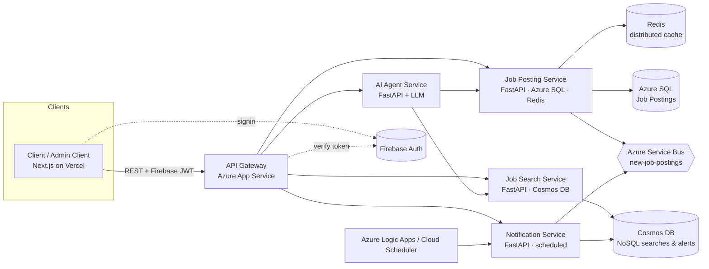

# SE 4458 — Final Project · Group 2

**Job Search Web Application** (kariyer.net-style) — full-stack microservice
implementation for the SE 4458 (Software Architecture & Design of Modern
Large Scale Systems) final, May 2026.

> **Course requirements addressed:** REST microservices, separately-deployed
> services behind an API Gateway, versioned & paginated APIs, distributed cache,
> NoSQL store, queue-driven notifications, scheduled tasks, Firebase IAM, AI
> agent, Dockerfiles, cloud deploy.

---

## Final deployed URLs

> ⚠️ Replace with your real URLs after deploy. The repo runs end-to-end with
> the placeholders filled in.

| Component                | URL                                                                    |
| ------------------------ | ---------------------------------------------------------------------- |
| Frontend (Next.js)       | <https://kariyer-4458.vercel.app>                                      |
| API Gateway              | <https://kariyer-4458-gateway.azurewebsites.net>                       |
| Job Posting Service      | <https://kariyer-4458-posting.azurewebsites.net> (`/api/v1/docs`)      |
| Job Search Service       | <https://kariyer-4458-search.azurewebsites.net>  (`/api/v1/docs`)      |
| Notification Service     | <https://kariyer-4458-notify.azurewebsites.net>  (`/api/v1/docs`)      |
| AI Agent Service         | <https://kariyer-4458-ai.azurewebsites.net>     (`/api/v1/docs`)       |

**Demo video (≤ 5 min):** <https://youtu.be/REPLACE_ME>

---

## Architecture overview



Detailed diagrams live in [`docs/architecture.md`](docs/architecture.md).

---

## Repository layout

```
job-search-app/
├── docker-compose.yml          # local dev orchestration only
├── .env.example                # all required env vars
├── docs/
│   ├── architecture.md         # high-level diagram + reasoning
│   └── er-diagram.md           # data models (SQL + NoSQL + cache keys)
├── services/
│   ├── api-gateway/            # FastAPI proxy (port 8000)
│   ├── job-posting-service/    # FastAPI + Azure SQL + Redis (port 8001)
│   ├── job-search-service/     # FastAPI + Cosmos DB (port 8002)
│   ├── notification-service/   # FastAPI + Service Bus + scheduler (port 8003)
│   └── ai-agent-service/       # FastAPI + LLM tool-calling (port 8004)
└── frontend/                   # Next.js 14 (App Router) + Tailwind + Firebase
```

Every backend service has its own `Dockerfile` and `requirements.txt` so the
assignment’s "deployed separately" rule holds.

---

## Data models

See [`docs/er-diagram.md`](docs/er-diagram.md) for the full ER diagram. Quick
summary:

* **Azure SQL** (Job Posting Service): `companies`, `job_postings`, `job_applications`.
* **Cosmos DB** (Job Search Service – NoSQL): `user_searches`, `user_alerts`, partitioned by `user_id`.
* **Redis** (Job Posting Service – distributed cache): `job:{id}`, `jobs:list:{hash}`, `autocomplete:{kind}:{q}`.

---

## How requirements map to the implementation

| Common Requirement                                                        | Where                                                                                 |
| ------------------------------------------------------------------------- | ------------------------------------------------------------------------------------- |
| Service-oriented framework                                                | FastAPI per service                                                                   |
| Simple UI per mock-ups                                                    | `frontend/app/*` — home, search, detail, admin, alerts, login, AI chat widget         |
| All business use cases via REST                                           | every router under `/api/v1/...`                                                      |
| Deployed to a cloud provider                                              | Azure App Service (backends) + Vercel (frontend) — see "Deploy" below                 |
| Job Search / Posting / Notification deployed **separately** behind a GW   | 5 backend services, each with its own Dockerfile + App Service                        |
| RabbitMQ or Azure Messaging                                               | `services/job-posting-service/app/queue.py` + notification consumer (Service Bus, RabbitMQ fallback)        |
| REST versioned + paginated                                                | every router mounted at `/api/v1`; list endpoints accept `?page=&page_size=`          |
| Distributed cache (≥1)                                                    | Redis used for Job Posting reads & autocomplete (`app/cache.py`)                      |
| IAM (Cognito / Firebase / Supabase)                                       | Firebase Auth — verified by gateway *and* every service (`auth.py`)                   |
| AI Agent (real-time NOT required)                                         | `ai-agent-service` exposes `/api/v1/agent/chat`, used by `ChatWidget.tsx`             |
| Job searches in NoSQL                                                     | Cosmos container `user_searches`, partition key `/user_id`                            |
| Dockerfile in source (no image)                                           | one per service + frontend                                                            |
| Cloud DB (no SQLite)                                                      | Azure SQL + Azure Cosmos DB                                                           |
| Cloud-scheduled tasks                                                     | `notification-service/app/jobs/{job_alert,related_job}_task.py`, called by Logic Apps |

---

## Run locally (one command)

```bash
cp .env.example .env       # fill in values; Firebase + LLM keys are optional for first run
docker compose up --build
```

Then open:

* <http://localhost:3000>  – frontend
* <http://localhost:8000/api/v1/docs> – gateway swagger (proxies to all services)

The Job Posting Service auto-creates tables and seeds 6 demo postings on first
boot, so the home page is not empty.

### Run / debug from VS Code

Open the repo root in VS Code. The `.vscode/` folder ships pre-configured
debug launchers — open the Run panel (⇧⌘D), pick **"ALL: backend + frontend"**
from the compound list and press F5 to start every service with breakpoints
enabled. Individual services can also be launched one at a time. Recommended
extensions (Python, Docker, ESLint, Tailwind, Prettier) auto-suggest on first
open.

For the frontend, copy `frontend/.env.local.example` to `frontend/.env.local`
and fill in your Firebase web SDK keys before running `npm run dev`.

### Without Docker (Python 3.12 + Node 20)

```bash
# In one terminal per service:
cd services/job-posting-service && pip install -r requirements.txt && uvicorn app.main:app --port 8001
cd services/job-search-service  && pip install -r requirements.txt && uvicorn app.main:app --port 8002
cd services/notification-service&& pip install -r requirements.txt && uvicorn app.main:app --port 8003
cd services/ai-agent-service    && pip install -r requirements.txt && uvicorn app.main:app --port 8004
cd services/api-gateway         && pip install -r requirements.txt && uvicorn app.main:app --port 8000

# And the UI:
cd frontend && npm install && npm run dev
```

The services degrade gracefully:

* Redis missing  → in-memory no-op cache
* Cosmos missing → in-memory dict
* Service Bus missing → uses RabbitMQ
* Firebase missing  → dev fallback user (logged with `_dev: true`)
* LLM key missing  → rule-based agent answers

---

## Deploy to Azure (recommended)

Frontend goes to **Vercel** (one-click Next.js host). Backends and infra go to
**Azure**.

### 1. Provision

```bash
RG=kariyer4458-rg LOC=westeurope
az group create -n $RG -l $LOC

# SQL
az sql server create -g $RG -n kariyer4458-sql -l $LOC -u sqladmin -p '<strong-pwd>'
az sql db   create -g $RG -s kariyer4458-sql -n jobpostings --service-objective S0

# Cosmos
az cosmosdb create -g $RG -n kariyer4458-cosmos --kind GlobalDocumentDB

# Redis
az redis create -g $RG -n kariyer4458-redis -l $LOC --sku Basic --vm-size c0

# Service Bus
az servicebus namespace create -g $RG -n kariyer4458-sb -l $LOC --sku Basic
az servicebus queue create -g $RG --namespace-name kariyer4458-sb -n new-job-postings
```

### 2. Container registry + images

```bash
az acr create -g $RG -n kariyer4458acr --sku Basic
az acr login -n kariyer4458acr

for s in api-gateway job-posting-service job-search-service notification-service ai-agent-service; do
  docker build -t kariyer4458acr.azurecr.io/$s:1.0 services/$s
  docker push      kariyer4458acr.azurecr.io/$s:1.0
done
```

### 3. Five separate App Services (one per backend)

```bash
az appservice plan create -g $RG -n kariyer4458-plan --is-linux --sku B1

for s in api-gateway job-posting-service job-search-service notification-service ai-agent-service; do
  az webapp create -g $RG -p kariyer4458-plan -n kariyer4458-$s \
    --deployment-container-image-name kariyer4458acr.azurecr.io/$s:1.0
done
```

Set environment variables (App Settings) per `.env.example` on each app.
Mount your Firebase service-account JSON via Azure Key Vault or upload it as
a secret file referenced by `GOOGLE_APPLICATION_CREDENTIALS`.

### 4. Frontend on Vercel

```bash
cd frontend
vercel --prod
# Set env vars in Vercel dashboard:
#   NEXT_PUBLIC_API_GATEWAY_URL = https://kariyer-4458-gateway.azurewebsites.net
#   NEXT_PUBLIC_FIREBASE_*      = (Firebase web config)
```

### 5. Schedule the two notification tasks

Use **Azure Logic Apps** (free tier) or **Google Cloud Scheduler**:

* Daily 02:00 UTC → `POST /internal/run-job-alert`
  Header: `X-Internal-Key: <INTERNAL_API_KEY>`
* Daily 03:00 UTC → `POST /internal/run-related-jobs`

Both are idempotent and return a small JSON report.

---

## Assumptions

1. **Reverse-geocoding is out of scope.** The home page reads
   `user_city` from `localStorage` (or assumes `İzmir` after a geolocation
   fix) — the assignment explicitly allows: *"or user citt (assume it is accessible)"*.
2. **Authentication is centralized at Firebase.** No local password storage.
   Admin/company privileges are granted via Firebase **custom claims**
   (`role=admin` / `role=company`). Use the Firebase CLI:
   `firebase auth:set-custom-user-claims <uid> '{"role":"admin"}'`.
3. **Notifications are stubbed.** The `notifier.send()` function logs a
   structured message; in a real deploy you’d swap it for SendGrid / Azure
   Communication Services / FCM. The course PDF says no payment integration
   is needed; we treat the delivery channel similarly.
4. **`Son Aramalarım`** is per logged-in user only; anonymous searches are
   stored under `user_id="anonymous"` but never surfaced.
5. **Pagination** is keyset-free (offset/limit). Acceptable for the dataset
   sizes we expect; would need cursor-based pagination at production scale.
6. **AI Agent** uses any OpenAI-compatible endpoint (works with OpenAI, Azure
   OpenAI, OpenRouter). If `LLM_API_KEY` is empty, a small rule-based
   fallback answers — useful for grading without burning tokens.
7. **Service-to-service auth.** The notification scheduler endpoints are
   gated by a static `X-Internal-Key`. Production-grade setups should use
   Azure Managed Identity instead; this static key keeps the demo simple.
8. **SQLite is intentionally not used** anywhere — Azure SQL Edge is the
   local dev DB so the connection string and ORM behavior match production.

## Known issues / nice-to-haves

* No automated tests yet (the assignment doesn’t require them; pytest scaffold
  could be added under each service).
* "Map view" of search results is intentionally omitted (not in Group 2's
  spec; that was a Group 1 hotel-search requirement).
* Autocomplete sources from already-posted titles only. A real product
  would maintain a curated taxonomy of positions and cities.
* Cosmos cross-partition queries (used in the related-job task) are RU-heavy;
  for production, switch to Change Feed.
* The API Gateway re-streams responses synchronously; a production gateway
  (e.g., YARP, Kong, Azure Front Door) would offer caching, rate-limiting,
  WAF, etc. The assignment explicitly says we should *not* pay for Azure API
  Management, so this bare proxy is the chosen alternative.

## Issues encountered while building

* **ODBC driver in Docker.** `pyodbc` needs `msodbcsql18` and `unixodbc-dev`
  installed in the image — captured in the Job Posting Service Dockerfile.
* **Cosmos DB local dev.** No real Cosmos emulator on macOS-ARM, so the
  service falls back to an in-memory store when `COSMOS_ENDPOINT` is empty.
* **Service Bus vs. RabbitMQ.** We dual-target both so local dev needs no
  Azure subscription.

---

## License & attribution

Educational project for SE 4458, Yaşar University. No production warranty.
