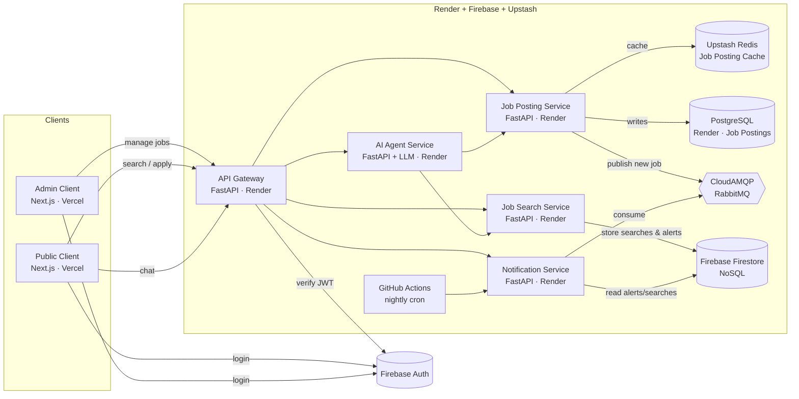

# Architecture

## High-level component diagram

## Service responsibilities

| Service | Responsibility | Storage |
|---|---|---|
| API Gateway | Single entrypoint, JWT verification, request routing, CORS | — |
| Job Posting Service | CRUD on jobs (admin/company), publishes new-job events, serves cached reads | PostgreSQL + Upstash Redis |
| Job Search Service | Search jobs by position/city + filters, autocomplete, persists user searches | Firebase Firestore |
| Notification Service | Two scheduled tasks: (a) job-alert notifier consumes queue + matches alerts; (b) related-job notifier reads user searches and sends suggestions | Firebase Firestore |
| AI Agent Service | Chat endpoint that calls Search & Posting APIs as LLM tools | — |

## Why this layout matches the assignment

- **"Deployed separately"** → each service has its own `Dockerfile`, its own `requirements.txt`, its own Render Web Service.
- **"All APIs via an API Gateway"** → public clients only know the gateway URL.
- **"Versioned + paginated REST"** → every router at `/api/v1`, list endpoints accept `?page=&page_size=`.
- **"At least one distributed caching solution"** → Upstash Redis for hot Job Posting reads.
- **"Job searches in separate NoSQL DB"** → Firebase Firestore collection `user_searches`.
- **"IAM service"** → Firebase Auth; gateway verifies the ID token.
- **"Queue solution (RabbitMQ or Azure Messaging)"** → CloudAMQP RabbitMQ.
- **"Scheduling services"** → GitHub Actions cron hits `/internal/run-job-alert` and `/internal/run-related-jobs`.
