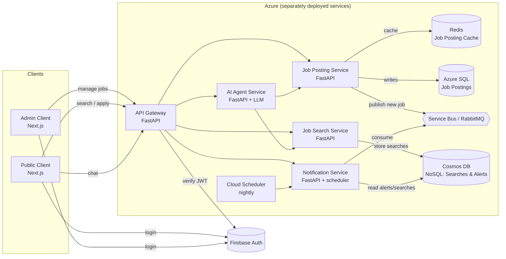

# Architecture

## High-level component diagram

## Service responsibilities

| Service               | Responsibility                                                                           | Storage                |
| --------------------- | ---------------------------------------------------------------------------------------- | ---------------------- |
| API Gateway           | Single entrypoint, JWT verification, request routing, CORS                               | –                      |
| Job Posting Service   | CRUD on jobs (admin/company), publishes new-job events, serves cached read               | Azure SQL + Redis      |
| Job Search Service    | Search jobs by position/city + filters, autocomplete, persists every user search         | Cosmos DB (NoSQL)      |
| Notification Service  | Two scheduled jobs: (a) job-alert notifier consumes queue + matches alerts; (b) related-job notifier reads user searches and emails suggestions | Cosmos DB (alerts)     |
| AI Agent Service      | Chat endpoint that calls Search & Posting APIs as LLM tools                              | –                      |

## Why this layout matches the assignment

- "Job Search, Hotel and Notification services will be deployed separately" → each service has its own `Dockerfile`, its own `requirements.txt`, its own port. The compose file is *only* for local dev.
- "All APIs reached via an API Gateway" → public clients only know `api-gateway:8000`.
- "REST services must be versionable and support pagination" → every router is mounted under `/api/v1`, list endpoints accept `?page=&page_size=`.
- "At least one distributed caching solution (i.e. Hotel Details)" → Redis is used for hot Job Posting reads (the assignment’s analog of "Hotel Details").
- "Job searches will be stored in a separate No SQL DB" → Cosmos DB container `user_searches`.
- "All user authentication will be stored in an IAM service" → Firebase Auth; gateway verifies the ID token via Firebase Admin SDK.
- "Use a queue solution (RabbitMQ or Azure Messaging)" → Azure Service Bus in prod, RabbitMQ for local dev.
- "Scheduling services" → Azure Logic Apps (or Cloud Scheduler) ping `/internal/run-job-alert` and `/internal/run-related-jobs` on the Notification Service.
