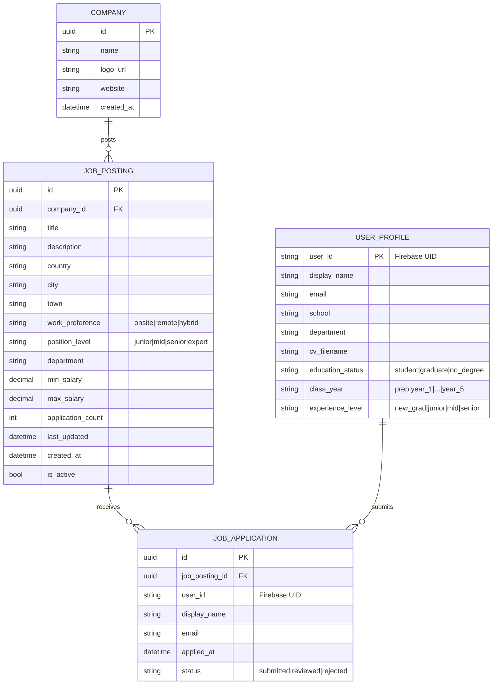

# Data models (ER)

## Relational store – Azure SQL (Job Posting Service)



## NoSQL store – Cosmos DB (Job Search Service)

Two containers, partitioned by `user_id` so every user’s history scans cheaply.

### `user_searches`

```json
{
  "id": "<uuid>",
  "user_id": "<firebase-uid or 'anonymous'>",
  "query_position": "Web Developer",
  "query_city": "Izmir",
  "query_country": "Türkiye",
  "filters": { "work_preference": "remote" },
  "result_count": 42,
  "searched_at": "2026-05-06T12:34:56Z"
}
```

### `user_alerts`

```json
{
  "id": "<uuid>",
  "user_id": "<firebase-uid>",
  "keywords": ["Web Tasarım Uzmanı"],
  "country": "Türkiye",
  "city": "Izmir",
  "town": null,
  "work_preference": null,
  "active": true,
  "created_at": "2026-05-06T12:34:56Z",
  "last_notified_at": null
}
```

## Cache layer – Redis

| Key pattern                   | Value                | TTL  | Purpose                          |
| ----------------------------- | -------------------- | ---- | -------------------------------- |
| `job:{id}`                    | JSON of full posting | 5 m  | Hot read for detail page         |
| `jobs:list:{hash(query)}`     | JSON page of results | 60 s | Cached search/list responses     |
| `autocomplete:position:{q}`   | JSON list of strings | 30 m | Position autocomplete            |
| `autocomplete:city:{q}`       | JSON list of strings | 30 m | City autocomplete                |
